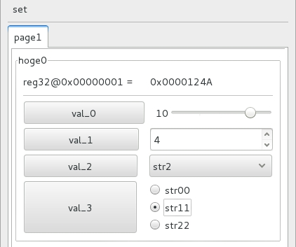

# Ktuneマニュアル
## はじめに
山下さん作成アプリXtuneを無許可でコピーしたフリーツール。 (100%自宅で開発したため会社は関係ないが、ラインセンスはグレー)  
言語作成の勉強のためコードはフルスクラッチで新規作成。機能はKtuneをコピっているが文法互換はなし。Lex+YACCを使用。

## 概要
GUIでのレジスタアクセスに特化したスクリプト言語  


## 基本構成

```
$page "page1"  #ページの生成。これは必須
$data32 hoge0 = {
  .addr = 0x0001
  .data = val_0 | val_1 | val_2 << 8 | val_3 << 12
}
val_0 = [0, 12, 10, 0]                     #スケール型widget, sc[0, 7, 0, 0]の省略形
val_1 = sp[0, 15, 0 ,4]                    #スピン型widget
val_2 = c["str0", "str1", "str2", 2]       #コンボボックス型widget　0,1,2の整数値
val_3 = r["str00", "str11" "str22", 1]     #ラジオボタン型widget 0,1,2の整数値
```

上記スクリプトから↓のGUIが簡単に生成可能！



---
## Ktuneとデバイスとの接続方法

ktuneは狭義ではGUIの生成とGUIでwidget変数を変化させた時に対応するaddr, data, miskの値をktune_user.c で定義されている`reg_setXX(addr, data, misk)`をコールすることで外部に伝える仕組みを示す。reg_setXX()関数では接続先デバイスに応じてデバイスのレジスタアクセス方式が記述される。ktune_user.cはreg_setXX()の他に`initialize()`も定義されているが、これはデバイスの初期化等に利用する関数である。通常`reg_setXX()や initialize()`はデバイス設計者が記述するためアプリユーザが直接記述する例は少ない。デバイス接続方法がUSB、PCIe、UART等でそれぞれktune_user.cは異なる記述となる。このデバイスアクセスを含めてktuneと呼ぶこともあるので注意が必要である。本マニュアルではデバイスアクセス方法についてはスコープ外とする。


## Ktune文法
---
### 型について
INT型、文字列型、widget型、レジスタ型の４種類ある。重要なのはwidget型とレジスタ型。

- INT型  
内部でint64_tと定義させている。変数の宣言はいらず`hoge = 10` と代入された時点で変数として登録される。演算子として四則演算、ビット演算子等が定義されていて演算子の優先順位はC言語に準拠する。  

- 文字列型  
`str = "str_hoge"`と記述することで文字列型変数が登録される。演算子は比較演算子(==)と連結演算子(+)をサポート  

- widget型  
GUIのWidgetを生成する変数。スケール、スピン、ラジオボックス、コンボボックスをサポート。詳細はWidget一覧を参照  

- レジスタ型  
即値型の$dataXX とバッファー型の$dataXXbがある。(XXは16,32,64)。レジスタ型変数はメンバとしてアドレス、データ、miskの３つの情報をもつ。widget型をデータに代入(右辺に記述)することで、GUIでwidget型変数が変化した際にaddr, data, miskの３つの情報がktune_user.c で定義されている`reg_setXX(addr, data, misk)`が呼ばれる仕組みとなっている。miskを定義しない場合には初期値０が代入される。即値型はGUIでwidget型変数が変化される毎にレジスタが送信されるが、バッファー型は送信ボタンを明示的に押すことでレジスタが送信される。

	```
	$data32 hoge {
	  .addr = val_addr * 16                    #式を記述してもOK, val_addrを16倍した値が代入される。
	  .data = (1<<16) | val_0 | val_1 | val_2  #右辺はwidget型の変数を記述するのが基本。式の記述もOK
	  .misk = 0                                #省略可能。
	}
	```


### Widget一覧
- スケール(scale)  
sc[min, max, def, shift]　scは省略可能。一番使うWidget, 90%はこれでOK  
scを省略時にmin=0, max=1の時は自動的にbuttonに変更される。  
shiftはビットシフトを示す。shift =4 と shit= 0で`.data = (val << 4)`は等価である。  
min, max, def, shitはINT型。式の記述もOK

- スピン(spin)  
sp[min, max, def, shift]  
スケール型と同じ。値を直接入力したい場合はこちらを使用すると良い

- ラジオボタン(radio button)  
r["str0", "str1", "str2", def]　defは省略可能、省略時はdef=0  

- コンボボックス(combo box)  
c["str0", "str1", "str2", def]　defは省略可能、省略時はdef=0  


### 特殊記号
ページ(タブ)の作成

```
$page "page1"
```

### 制御文
制御文として`if-elsif-else`構文をサポート。C言語で許されている{ }の省略(ぶら下がりif文)は認められていない。ifのネストもサポート。以下の例はmodeによりwidget変数valの初期値を変えているが、無理やりifを使用した例である。正直IF制御文を使用する機会はほとんどないだろう。

```
MODE = "mode1"
if (MODE == "mode1") {
  val = [0, 7, 0, 0]
}
elsif (MODE == "mode2"){
  val = [0, 7, 1, 0]
}
else {
  val = [0, 7, 2, 0]
}
```

### コメントの記述方法
- 1行コメント  
「#」の後がコメントとなる。`＃ this is comment `  

- ブロックコメント  
複数行のコメントはC言語と同じ　「/\*」 「\*/」 で囲む方式 　`/*  Block Comment */`  
